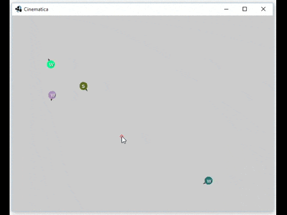

# Prática: Movimentação Cinemática


Pré-requisitos:
  1. Assistir [o vídeo promocional][promo] do  _framework_ de jogos LibGDX
  1. Um pouco de Java
    - Sugiro IDE NetBeans com plugin _Gradle Support_ instalado
  1. Geometria afim (bem de leve)

Objetivos:

  1. Enxergar a movimentação de agentes como um algoritmo
  1. Entrar em contato com um _framework_ para desenvolvimento de jogos
  1. Praticar algoritmos de movimentação simples usando cinemática

[promo]: https://libgdx.badlogicgames.com/

## Atividade Prática

Você deve começar usando o código do professor como ponto de partida para a
atividade. Você deve implementar 3-4 algoritmos simples de movimentação, que
usam conceitos de cinemática da física (posição, velocidade e, no máximo,
aceleração constante). Os algoritmos são:

1. **Perseguir (_seek_)**
1. **Fugir (_flee_)**
1. **Vagar (_wander_)**
1. **Chegar (_arrive_)** [opcional]

## Resultado Esperado



## _Background Teórico_

Descrevemos um **Agente Cinemático** (`Agente.java`) por:

1. Posição
  - Vetor 2-dimensional com as coordenadas do agente
1. Orientação
  - Um escalar (entre 0 e 2&pi;) representando para onde o agente está olhando
1. Velocidade
  - Vetor 2-dimensional representando variações nos eixos X e Y
1. Rotação
  - Um escalar (entre 0 e 2&pi;) representando uma variação na orientação

A movimentação acontece em dois passos:

1. Passo de IA: Um algoritmo de movimentação (_e.g._, _seek, wander_)
  determina para onde o agente deve ir
1. Passo de Física: Usamos integração de Euler para atualizar a posição do
  agente de acordo com o movimento do passo anterior (veja `Pose.java:integra`)
  - Em cada _frame_ de atualização:
    ```
    posicao += velocidade * delta;
    orientacao += rotacao * delta;
    ```

O algoritmo de movimentação cinemático tem como:

- **Entrada**: dados estáticos (posição, orientação do agente)
- **Saída**: vetor velocidade e/ou ângulo de rotação

Os algoritmos que vamos implementar:

1. **Perseguição**: Agente recebe uma posição Objetivos
  - Calcule a direção desejada
    - Considere a posição do objetivo e a posição do agente
  - Normalize o vetor direção, mas multiplique-o pela velocidade máxima
1. **Fuga**: Inverso da velocidade de perseguição (x -1)
1. **Vagar**:
  - Agente sempre na velocidade tangencial máxima
  - Direção sofre pequenas variações aleatórias a cada quadro
1. **Chegar**: Variação da Perseguição
  - Determinar um "raio de chegada"
  - Reduzir a velocidade dentro do raio
    - Quanto mais próximo do objetivo, menor a velocidade

---
## Entrega

~~Este trabalho deve ser entregue **via Moodle**. Mas caso o Moodle ainda não esteja funcionando de vento em polpa,~~ considere o parágrafo a seguir.

Os exercícios desta aula prática serão corrigidos ao final do nosso horário. Assim que estiver pronto, chame o professor para que possa ver seu trabalho.
