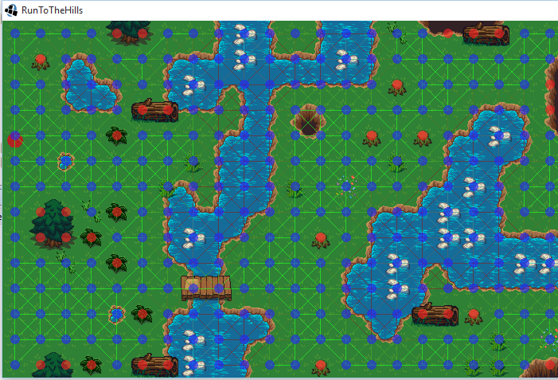

# Prática: Planejamento de Caminhos



Pré-requisitos:
  1. Um pouco de Java
    - Sugiro IDE NetBeans com plugin _Gradle Support_ instalado
    - Mesmo _setup_ da prática sobre movimentação
  1. Conhecimento sobre grafos

Objetivos:

1. Implementar algoritmos de planejamento de caminhos em grafos
1. Traduzir o algoritmo de Dijkstra em código Java
1. Implementar o algoritmo A*
1. Perceber que o algoritmo de Dijkstra é o A* que não considera heurística

## Atividade Prática

Você deve começar usando o código do professor como ponto de partida para a
atividade. Você deve implementar 3 heurísticas para o algoritmo A*:

1. Uma heurística "nula", que transforme o A* no Dijkstra
2. A heurística de distância Euclidiana
3. (Opcional) Uma outra heurística à sua escolha (e pesquisa ;)

## _Background Teórico_

Descrevemos um **Agente** (`Agent.java`) por:

1. Algoritmo de movimentação (_steering_)
1. Algoritmo de planejamento
  - Que, por sua vez, pode conter uma função heurística

A movimentação acontece em três passos. Assim que um clique é feito:

1. Passo de Planejamento: Um algoritmo de planejamento (no caso, A*) encontra
  a melhor rota para o ponto desejado.
1. Passo de Movimentação: Um algoritmo de movimentação (no caso, _seek_)
  determina para onde o agente deve ir. O objetivo (_target_) do algoritmo é
  definido sempre como o próximo nó do caminho retornado pelo passo de
  planejamento.
1. Passo de Física: Usamos integração de Euler para atualizar a posição do
  agente.

Um algoritmo de controle identifica se o passo de movimentação cumpriu
seu objetivo e, em caso afirmativo, define o objetivo como o próximo nó do
caminho. Veja o trecho de código de `Agent.java:44`:

```java
public void update(float delta) {
    boolean shouldMove = true;

    // verifica se atingimos nosso objetivo imediato
    if (position.coords.dst2(steeringTarget.coords) < MIN_DISTANCE_CONSIDERED_ZERO_SQUARED) {
        // procurar se temos outra conexão na nossa rota
        // e, caso afirmativo, definir o nó de chegada como novo target
        if (shouldMove = pathIterator.hasNext()) {
            TileConnection nextConnection = pathIterator.next();
            TileNode nextNode = nextConnection.getToNode();
            steeringTarget.coords = nextNode.getPosition();

            // atualiza a velocidade do "seek" de acordo com o terreno (a conexão)
            this.behavior.maxSpeed = fullSpeed - (fullSpeed / 2.0f) * (nextConnection.getCost() - 1) / (LevelManager.maxCost - 1);
        }
    }

    // integra
    if (shouldMove) {
        Steering steering = behavior.steer(this.position);
        position.integrate(steering, delta);
    }
}
```

O Agente (`Agent.java:68`) recebe um evento de clique quando o usuário clica em
uma parte do mapa. Nesse momento, acionamos o algoritmo de planejamento para
traçar a rota:

```java
public void setGoal(int x, int y) {
    TileNode startNode = LevelManager.graph.getNodeAtCoordinates((int) this.position.coords.x, (int) this.position.coords.y);
    TileNode targetNode = LevelManager.graph.getNodeAtCoordinates(x, y);

    path.clear();
    pathFinder.searchConnectionPath(startNode, targetNode, new EuclideanDistanceHeuristic(), path);
    pathIterator = path.iterator();
}
```

---
## Entrega

~~Este trabalho deve ser entregue **via Moodle**. Mas caso o Moodle ainda não esteja funcionando de vento em polpa,~~ considere o parágrafo a seguir.

Os exercícios desta aula prática serão corrigidos ao final do nosso horário. Assim que estiver pronto, chame o professor para que possa ver seu trabalho.
