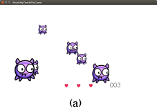
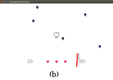

# Trabalho Prático 1 - Escovemeudenteporfavor


[][ratinho]

Uma criança típica já nasce programada para sentir medo de pelo menos 3 coisas
no mundo: (a) Bicho Papão, (b) Dentistas e (c) Palhaços. Alguns desses medos
são prejudiciais para a formação da crinça, como o caso do medo do (a)
Bicho Papão que, na realidade, nunca foi visto mundo material, e do medo dos
(b) Dentistas, que só estão ali para ajudar. O outro medo (c) é de
criaturas coloridamente perigosas e terríveis e as crianças
fazem bem em mantê-lo mesmo quando adultas. Até mesmo os professores.

Neste trabalho pretendemos ajudar crianças a entrarem tranquilas na salinha
do dentista. Para isso, vamos criar um jogo simples, descomprometido e maroto,
para que crianças (e ~~criançonas~~ adultos) possam jogar enquanto estão na
sala de espera.


## Inspiração

Há alguns jogos digitais que de uma certa forma
[mudaram o mundo][changed-world]. Outros jogos, um pouco menos raros, propõem
mecânicas tão singulares que acabam por definir um novo gênero de jogo. Um
desses jogos foi o WarioWare.

[][warioware-video]

O jogo coloca o jogador contra desafios extremamente curtos, independentes
e focados em uma  mecânica de controles simples. Esses desafios - ou
**_microgames_** - são colocados em sequência (de aproximadamente 20)
e devem ser cumpridos ininterruptamente e com pressa - cada um leva
até 5 segundos.

O senso de humor extravagante e o desafio de vencer as sequências de
_microgames_ fizeram da série de jogos WarioWare um sucesso.

Outros jogos foram feitos usando uma mecânica similar, como o (i)
[Dumb Ways to Die][dumb-ways], uma iniciativa do governo australiano
para conscientizar crianças sobre perigos na vida real (_e.g._, ~~palhaços~~
andar nos trilhos de um trem, não olhar para atravessar a rua), o (ii)
[Mini Mix Mayhem][mini-mix], um jogo em que o jogador deve resolver 4
_microgames_ ao mesmo tempo e o (iii) [Beat the Boot][beat-the-boot], jogo
da Google para anunciar que seus Chromebooks levavam só 8 segundos para
ligar - cada desafio deveria ser completado em até 8 segundos.

## Escovemeudenteporfavor

Neste trabalho, vamos todos nós desenvolver o mesmo jogo, tudo junto. Tipo
MMODesenvolvimentoDeJogos (MultiProgramador Massivo Online etc. etc.).

O jogo já tem um arcabouço mínimo de programação pronto e disponível em um delicioso
[repositório disponibilizado no GitHub][repo]. A documentação (comentários, um ou outro diagrama) está
disponibilizada no próprio repositório.

Existem 2 _microgames_ prontos: (a) `ShootTheCaries` e (b) `ShooTheTartarus`. No
primeiro (a), o jogador deve atirar (com o mouse ou tocando a tela) em todas as cáries antes que o
tempo acabe. No segundo (b), o jogador deve proteger todos os dentes,
espantando os tártaros malignos que se aproximam.




### O que deve ser feito

Cada grupo de 1 a 2 integrantes deve **criar 2 novos _microgames_** na temática
proposta para o jogo. Os _microgames_ devem seguir um padrão similar aos
microjogos já existentes, mas **devem ter mais qualidade** e **não devem seguir o mesmo
estilo gráfico** - no WarioWare, por exemplo, cada _microgame_ tem seu próprio
estilo.

Há dois tipos de _microgame_ e você deve escolher os formatos dos seus:

1. `TimeoutBehavior.WINS_WHEN_MINIGAME_ENDS`: jogador deve evitar que algo aconteça até o tempo do _microgame_ acabar. O `ShooTheTartarus` é desse tipo.
1. `TimeoutBehavior.FAILS_WHEN_MINIGAME_ENDS`: o jogador deve fazer algo antes que o tempo acabe. O `ShootTheCaries` é assim.

Cada _microgame_ deve poder ser **configurado quanto a sua dificuldade**. Ao ser instanciado, ele recebe um nível de dificuldade entre 0 e 1, em que 0 é o nível mais fácil e 1 é o nível mais impossível.

O jogo é destinado a executar em três plataformas, sendo elas _desktop_, dispositivos móveis e _web_, com a intenção de que ele execute tanto em _smartphones_ quanto em outros dispositivos como _smart TVs_ cujos aplicativos são baseados na _web_ (_e.g._, WebOS, FirefoxOS). Isso traz mais dois requisitos não-funcionais ao jogo:
- **Independência de resolução**
  - Almejamos a razão de aspecto 16:9, com uma resolução ideal de 1280:720 (_i.e._, _high definition_).
  - Contudo, os _microgames_ devem executar em qualquer resolução.
    - Veja no repositório como a [independência de resolução][resolution-independence] está sendo feita.
- **_Input_ via mouse ou toque**
  - Para que seja possível jogar em um computador, dispositivo sensível a toque e dispositivo com apontador estilo o controle do Wii (_e.g._, _smart TVs_ com sistema WebOS).
  - A LibGDX possui abstrações de `input` (em `if (Gdx.input.justTouched() == true)`, por exemplo) que já nos dão a flexibilidade que precisamos.


### Descrição da implementação

O jogo está feito em LibGDX - Java e OpenGL. Para criar os _microgames_ é
permitido usar outras bibliotecas, como a [Box2D][box2d-libgdx] para
rotinas de física, por exemplo.

Criar um _microgame_ no jogo é uma tarefa com 3 etapas:

1. **Criar uma classe** (_e.g._, `MicroJogoMarotex`) que herda as funcionalidades e tipo (_i.e._, `extends`) da classe abstrata `MiniGame`. Exemplo:
  ```java
  public class MicroJogoMarotex extends MiniGame {
      // ...
      @Override
      public void onHandlePlayingInput() {
          // lidar com input do jogador
      }

      @Override
      public void onUpdate(float dt) {
          // atualizar a lógica do minigame
      }

      @Override
      public void onDraw() {
          // desenhar as paradas
      }
      // ... outros métodos
  }
  ```
  - Caso o jogador consiga vencer o desafio antes do tempo do _microgame_,
    você deve chamar `super.challengeSolved()` nesse momento.
  - Analogamente, caso o jogador perca o desafio antes do tempo, você
    deve chamar `super.challengeFailed()`.
1. **Criar uma classe** (_e.g._, `MicroJogoMarotexFactory`) que
  implementa (_i.e._, `implements`) a interface `MiniGameFactory`. Exemplo:
  ```java
  public class MicroJogoMarotexFactory implements MiniGameFactory {
      @Override
      public MiniGame createMiniGame(BaseScreen screen,
        GameStateObserver observer, float difficulty) {
          // retorna uma nova instância de
          // MicroJogoMarotex, e.g.:
          // return new MicroJogoMarotex(...);
      }

      @Override
      public Map<String, Class> getAssetsToPreload() {
          // retorna um conjunto de assets para serem
          // pré-carregados antes deste
          // minigame começar
      }
  }
  ```
1. **Alterar a classe da tela de jogo** (`PlayingGamesScreen`) para colocar
  o novo _minigame_ como elegível para sorteio:
  
  ```java
  // ...
  public PlayingGamesScreen(Game game, BaseScreen previous) {
      // ...
      this.sequencer = new GameSequencer(5, new HashSet<MiniGameFactory>(
              Arrays.asList(
                      new ShootTheCariesFactory(),
                      new ShooTheTartarusFactory()),
                      // COLOQUE ESTA LINHA:
                      new MicroJogoMarotexFactory()
      ), this, this);
  }
  ```

## Avaliação

Seu trabalho será avaliado quanto à criatividade dos _microgames_ e à
qualidade do resultado final e da implementação.

## O que faz perder nota

Alguns descuidos podem fazer com que sua nota fique muito abaixo do esperado:
- Seu trabalho não executa: nota 0
- Atraso na entrega. Cada dia de atraso reduz o valor máximo de nota da
  maneira abaixo. Considere `x` como dias de atraso e `f(x)` a penalidade
  percentual na nota:

  
  - Isso implica que 1 ou 2 dias de atraso são pouco penalizados
  - E após 5 dias de atraso, o trabalho vale 0
  - _Seeing is believing_: https://www.google.com.br/search?q=y%3D(2%5E(x-2)%2F0.16)%2Cy%3D100


## O que deve ser **entregue**

Deve ser entregue **um _pull request_** via **GitHub** contendo os _commits_
com o código e _assets_ criados pelo grupo.

Veja no [repositório][repo] algumas instruções mais detalhes acerca da entrega.

[ratinho]: https://www.youtube.com/watch?v=BJM8lj3PQbc
[changed-world]: http://www.makeuseof.com/tag/10-video-games-that-changed-the-world/
[warioware-video]: https://www.youtube.com/watch?v=Ch9YyYiBvQY
[dumb-ways]: https://www.youtube.com/watch?v=IJNR2EpS0jw
[mini-mix]: https://play.google.com/store/apps/details?id=com.brokenbeta.minimixmayhem&hl=pt_BR
[beat-the-boot]: http://beattheboot.appspot.com/
[repo]: https://github.com/fegemo/cefet-games-brushmyteethplz
[box2d-libgdx]: https://github.com/libgdx/libgdx/wiki/Box2d
[resolution-independence]: https://github.com/fegemo/cefet-games-brushmyteethplz/blob/master/README.md#sistema-de-coordenadas
