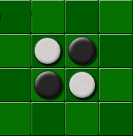

# Trabalho Prático 1 - Othelo

O jogo **Reversi** foi criado na década de 1880 por dois ingleses, Lewis
Waterman e John Mollet e cada um acusou o outro de ter roubado sua ideia. Por
volta de 1970, uma empresa Japonesa, mais esperta que os dois, patenteou o jogo
sob o nome de **Othelo**.

Neste primeiro trabalho prático, vamos implementar o jogo Othelo (ou Reversi)
com a possibilidade de jogar contra o "computador".

## Instruções sobre o jogo

O jogo consiste em um tabuleiro de 8x8 lugares e 64 peças cilíndricas que podem
ter uma cor preta ou branca em determinado momento (tipicamente, um lado preto
e outro branco). Cada um dos 2 jogadores assume uma cor e seu objetivo é
terminar o jogo com o tabuleiro contendo um número maior de peças de sua cor que
da cor do outro. O jogo começa com 4 peças colocadas nos lugares centrais com
disposição alternada, assim como mostrado na figura.

Em cada jogada, um jogador deve colocar uma peça nova, da sua cor, no
tabuleiro. Ele só pode colocar peças em locais:
  1. adjacentes a alguma peça do outro jogador considerando 8 direções
  1. e que faça pelo menos uma conversão de peça do outro jogador

Um conversão de peça acontece quando a colocação de uma peça de uma cor "feche"
uma sequência (1+) de peças do outro, sendo que para isso é necessário ter uma
peça da sua cor na direção de uma peça adjacente. A animação a seguir deve
esclarecer.

O jogo acaba quando não há mais jogadas válidas para nenhum dos dois jogadores
ou quando o tabuleiro fica totalmente preenchido.

Esse conjunto de funcionalidades descritas até aqui vale 80% da nota do
trabalho. Para se obter o restante dos pontos do trabalho (ou até mesmo alguns pontos extras, até o limite de 133% da pontuação do trabalho) funcionalidades adicionais podem ser implementadas no jogo. Essas funcionalidades serão
avaliadas conforme a **dificuldade da implementação**, o **efeito obtido** com ela no jogo e a **qualidade da implementação**. Exemplos de funcionalidades extras com suas respectivas pontuações **máximas**:

1. Ter uma interface gráfica com um nível melhor que o terminal **(até 15%)**
1. Ter um modo de jogo multiplayer local para 2 jogadores **(7%)**
1. As **peças podem ser animadas**, por exemplo, quando uma peça é colocada,
   quando ela muda de cor etc. **(até 7%)**
1. **Sons**. Colocar efeitos sonoros e música de fundo no seu jogo **(até 4%)**
1. **Poda alfa-beta** para evitar buscas em ramos desnecessários durante a
   aplicação do algoritmo Mini-Max **(10%)**
1. **Modo de _debug_** que mostra, a cada momento, quais são as jogadas válidas
   **(até 6%)**
1. Qualquer outra idéia que torne o jogo melhor ou mais bonito. Essas idéias
   precisam ser documentadas e explicadas no documento de entrega do trabalho
   e a pontuação será dada de acordo com a complexidade e a qualidade
   da implementação

## Instruções gerais

O trabalho é em grupos de até 3 (sem exceções) e deve ser produzido
integralmente pelos alunos. Podem discutir idéias entre os colegas, mas cada
grupo deve ter a sua implementação independente dos demais. **Trabalhos muito
semelhantes receberão nota 0**, independente de quem copiou de quem. Trabalhos
semelhantes aos de outras pessoas (ex-alunos, pessoas na Internet) também
receberão nota 0.

## O que faz perder nota

Alguns descuidos podem fazer com que sua nota fique muito abaixo do esperado:
- Seu trabalho não executa: nota 0
- Cópia de trabalho de outrem: nota 0
- Ausência de qualquer item obrigatório da entrega (descrito na próxima seção)
- Ausência de itens da especificação obrigatória
- Baixa legibilidade do código
- Baixa qualidade da implementação
- Atraso na entrega. Cada dia de atraso reduz o valor máximo de nota da
  maneira abaixo. Considere `x` como dias de atraso e `f(x)` a penalidade
  percentual na nota:

  
  - Isso implica que 1 ou 2 dias de atraso são pouco penalizados
  - E após 5 dias de atraso, o trabalho vale 0
  - _Seeing is believing_: https://www.google.com.br/search?q=y%3D(2%5E(x-2)%2F0.16)%2Cy%3D100

## O que deve ser **entregue**

Deve ser entregue **um arquivo .tar.gz ou .zip** via **Moodle** contendo:
  1. 3+ _screenshots_ de diferentes cenas do seu jogo
  1. Todo o programa fonte, juntamente com as bibliotecas necessárias
     para compilação e execução
  1. O arquivo executável
  1. Um arquivo **README** contendo:
     - Instruções para **compilação e execução**
     - **Lista de itens adicionais** que seu jogo está pleiteando
     - Breve descrição das decições de implementação
  1. (opcional, +3%) O link para **um vídeo curto** (youtube, vimeo,
     dailymotion etc.) do seu jogo mostrando as opções implementadas

Qualquer dúvida, entre em contato comigo. Ou acrescente a sua interpretação no
arquivo README e mãos à obra.
