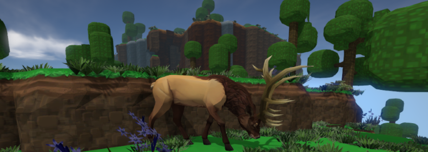
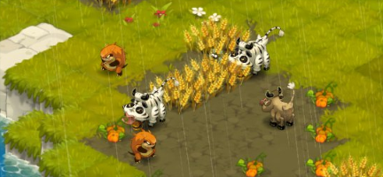
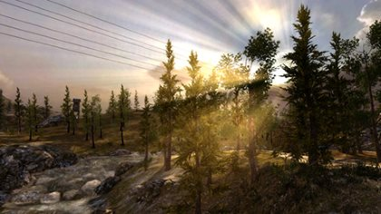
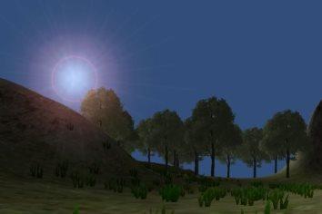

# Trabalho Prático 2 - Ecossistema

Ecossistemas tem sido estudados usando-se simulações cada vez
[mais complexas][aries]. Alguns jogos digitais têm como peça central de sua
jogabilidade um simulador de ecossistema, como é o caso do [jogo Eco][eco],
que tem um objetivo educacional, e do [jogo Universim][universim], cujo
objetivo é possibilitar o jogador evoluir a civilização de seu planeta,
mas havendo consequências devido a forma como ele lida com o meio ambiente.

Outra abordagem, introduzida pelo
<abbr title="Massively Multiplayer Online Role-Playing Game">MMORPG</abbr>
[Wakfu][wakfu], é usar um pequeno simulador de ecossistema como um
recurso adicional de _gameplay_ no jogo. Nele, fauna e flora formam um
ecossistema vivo cuja prosperidade depende indiretamente das decisões
feitas pelo jogador ao controlar seu personsagem.

Por exemplo, se o jogador mata muitos _gobbals_ (ovelhinhas divertidas)
para ganhar experiência e evoluir, mas não dá tempo suficiente para eles
se reproduzirem, a espécie pode ser extinta. Se colher frutos demais
(recuperar vida) sem replantar, pode ser a última colheita e os animais
herbívoros podem passar apertado também.

Neste trabalho prático, vamos implementar um pequeno simulador de ecossistema
usando um motor de jogos a sua escolha. O objetivo do trabalho é praticar
mais os conceitos de computação gráfica do que a simulação propriamente dita.
Portanto, procure fazer uma simulação o mais simples possível inicialmente e,
caso tenha tempo e interesse, evolua-a com novos comportamentos, espécies e
interações.

## Características do simulador

Considere as seguintes características para o simulador:
- Deve ser usado um motor de jogos em 3 dimensões.
- Deve haver um cenário relativamente grande onde as espécies viverão.
- Deve existir um _skybox_ representando uma visão do horizonte.
- Deve ser possível passear no cenário usando um controle semelhante ao
  de jogos _first-person_ (`w,a,s,d` + _mouse_) ou _third-person_.
- Deve haver um terreno, que pode ser plano.
- Deve haver 3 entidades que formam o ecossistema (serão descritas
  mais adiante).
  - As entidades devem ser modelos 3D¹ e devem ter animação de, no mínimo,
    à toa, movimentação e comendo (exceto para vegetação).
  - A simulação deve começar com um conjunto balanceado de entidades.

### Sobre o ecossistema

Seu ecossistema deve ter 3 entidades, que formam uma cadeia alimentar linear:
1. Plantas
2. Animais herbívoros (_e.g._, ovelhas)
3. Animais carnívoros (_e.g._, ~~lobos~~ ovelhas canibais :)

Veja um [simulador online de ecossistema][learner-sim] para ter uma ideia
de como funciona a lógica de evolução do sistema. O nosso será muito mais
simples que esse do ponto de vista lógico.

Cada entidade possui uma quantidade de energia vital (pense HP) e, se essa
energia zera por algum motivo, ela morre.

As plantas estão constantemente se alimentando (aumentando energia) e, quando
elas antingem um certo nível (_e.g._, 80%), elas passam a ter uma chance
de se reproduzirem (de forma assexuada) em sua vizinhança próxima. Quando
se reproduzem, elas gastam uma quantidade aleatória de energia (_e.g._, 30
a 60%). Quando uma nova plantinha nasce, ela começa com 10% apenas.

Os animais herbívoros possuem 4 estados: `VAGANDO`, `PROCURANDO_COMIDA`,
`COMENDO` e `FUGINDO`. A implementação pode ser feita usando-se uma máquina de
estados simples (<abbr>Finite State Machine</abbr>) e você tem toda a
liberdade para estipular os critérios de transição entre estados: por exemplo,
quando a energia está abaixo de 50%, se o animal não está sendo perseguido,
ele passa para o estado `PROCURANDO_COMIDA`.

Os animais carnívoros possuem 3 estados: `DORMINDO`, `CAÇANDO` e
`COMENDO`. Devido ao grande esforço físico, os carnívoros perdem vida
gradativamente enquanto estão caçando (eles multiplicam sua velocidade
por 1,5x enquanto estão caçando). Portanto, se eles caçam por muito tempo
sem pegar uma presa, podem morrer.

Enquanto um animal está comendo, ele vai recuperando vida gradativamente,
enquanto que o que está sendo comido vai perdendo.

Os animais possuem também sexo e uma idade e, a partir de um certo valor,
passam a poder se reproduzir, porém de forma sexuada. Para se candidatar
à reprodução, o animal precisa estar com boa energia (_e.g._, 80%+) e estar
próximo de outro animal, do sexo oposto, nas mesmas condições.

Esse conjunto de funcionalidades descritas até aqui vale 70% da nota do
trabalho. Para se obter o restante dos pontos do trabalho (ou até mesmo
alguns pontos extras, até o limite de 133% da pontuação do trabalho)
funcionalidades adicionais podem ser implementadas no jogo. Essas
funcionalidades serão avaliadas conforme a **dificuldade da implementação**,
o **efeito obtido** com ela no jogo e a **qualidade da implementação**.
Exemplos de funcionalidades extras com suas respectivas pontuações
**máximas**:

- Relativas ao **Cenário**:
  1. **Cenário rico (até 10%)**: pode haver objetos variados¹ espalhados
    pelo cenário: vários tipos de rochas, árvores, ruínas etc.
    - Entidades que se movimentam não podem entrar nos obstáculos.
    - Fazer as entidades **desviarem dos obstáculos (+4%)**.
  1. **Distribuição pseudo-aleatória (4%)**: em vez de posicionar os
    objetos (do cenário rico) você mesmo, você pode usar um algoritmo
    para fazê-lo. Veja como o pessoal do jogo Spore usou uma
    [sequência de Halton para distribuir objetos][spore] nos planetas.
  1. **Relevo** não plano:
    - Relevo exceto em uma **"clareira plana" (4%)**: onde as entidades
      ficam
    - Relevo em **todo o chão (10%)**: precisa considerar posição Z e
      orientação 3D das entidades.
  1. **Lago ou cachoeira (até 4%)** ¹
- Funcionalidades **Gráficas**:
  1. **Sombras (até 3%)**: provocadas pelas fontes de luz.
  1. **Dia/noite (até 8%)**: faça o tempo passar dentro do simulador.
    A duração de 1 dia pode ser, por exemplo, 3 minutos. A iluminação e/ou
    o _skybox_ e/ou sombras das entidades podem refletir o horário.
    - Entidades podem fazer **coisas diferentes dependendo do horário (+3%)**:
      por exemplo, dormir.
  1. **Efeitos atmosféricos (até 8%)**: neblina, chuva e neve podem compor
    o cenário. Estas duas últimas podem ser feitas usando-se efeitos de
    partículas.
    - **Previsão do tempo (5%)**: em vez de gerar o efeito atmosférico
      aleatoriamente, faça uma consulta a um _web service_ de consulta às condições atuais (ou previsão) do tempo para instanciar o efeito de
      acordo.
  1. **_God rays_ (4%)**: também conhecido como _sun shafts_ são um efeito
    visual obtido pelos raios solares que passam por "buracos" em nuvens
    ou outros objetos e formam colunas de ar iluminado separados por
    regiões mais escuras, não iluminadas.

    
  1. **_Lens flare_ (2%)**: efeito (~~in~~)desejado causado pela incidência
    forte de raios de luz intensos em lentes.

    
  1. **Mini-câmera (5%)**: quando um evento importante está para acontecer
    (_e.g._, uma entidade está prestes a morrer), crie uma mini-câmera,
    mostrada no canto direito inferior, para deixar que o usuário veja
    essa importante cena. Você deve usar um recurso chamado textura
    renderizada (ou _render texture_).
  1. **_Shaders_ não convencionais (até 8%)**: em vez de usar o _Phong_ ou
    suas variações classiconas, use _shaders_ não-fotorrealistas
    (<abbr title="Non-Photorrealistic Rendering">NPR</abbr>) ou então
    super-realistas
    (<abbr title="Physically-Based Rendering">PBR</abbr>).
    - Contudo, seja consistente no estilo geral da sua simulação.
    - Para ganhar total, você mesmo deve escrever o código do _shader_
- Funcionalidades **Diversas**:
  1. **Música e efeitos sonoros (até 8%)**: para compor e ambientar o cenário.
  1. **Modo de _debug_ (3%)**: mostra, a cada momento, como cada entidade
    está se comportando.
  1. Gerar um **_screensaver_ ou _live wallpaper_ (5%)**: para que pessoas
    possam ficar assistindo ao ecossistema enquanto comem pipoca.
  1. Qualquer **outra idéia (??)**: que torne a simulação melhor ou mais
    bonito. Essas idéias precisam ser documentadas e explicadas no
    documento de entrega do trabalho e a pontuação será dada de acordo
    com a complexidade e a qualidade da implementação.

## Instruções gerais

O trabalho pode ser feito em grupos de até 3 (sem exceções) e deve
ser produzido integralmente pelos alunos. Podem discutir idéias entre
os colegas, mas cada grupo deve ter a sua implementação independente dos
demais. **Trabalhos muito semelhantes receberão notas muito semelhantes
e tendendo a 0**, independente de quem copiou de quem. Trabalhos
semelhantes aos de outras pessoas (ex-alunos, coleguinhas na Internet)
também receberão nota 0.

## O que faz perder nota

Alguns descuidos podem fazer com que sua nota fique muito abaixo do esperado:
- Seu trabalho não executa: nota 0
- Cópia de trabalho de outrem: nota 0
- Ausência de qualquer item obrigatório da entrega (descrito na próxima seção)
- Ausência de itens da especificação obrigatória
- Atraso na entrega. Cada dia de atraso reduz o valor máximo de nota da
  maneira abaixo. Considere `x` como dias de atraso e `f(x)` a penalidade
  percentual na nota:

  
  - Isso implica que 1 ou 2 dias de atraso são pouco penalizados
  - E após 5 dias de atraso, o trabalho vale 0
  - _Seeing is believing_: https://www.google.com.br/search?q=y%3D(2%5E(x-2)%2F0.16)%2Cy%3D100

## O que deve ser **entregue**

Deve ser entregue **um arquivo .tar.gz ou .zip** via **Moodle** contendo:
  1. 3+ _screenshots_ de diferentes cenas do seu jogo
  1. Todo o programa fonte, juntamente com as bibliotecas necessárias
     para compilação e execução
  1. O arquivo executável/instalador
  1. Um arquivo **`README`** contendo:
     - Instruções para **compilação e execução**
     - **Lista de itens adicionais** que seu simulador está pleiteando
     - Breve descrição das decições de implementação
  1. (opcional, +3%) O link para **um vídeo curto** (youtube, vimeo,
     dailymotion etc.) do seu simulador mostrando as opções implementadas

Qualquer dúvida, entre em contato comigo. Ou acrescente a sua interpretação no
arquivo `README` e mãos à obra.

¹ Você pode usar recursos de terceiros, mas deve documentar isso no
`README` que será entregue e também dentro do simulador (_e.g._,
tela de créditos). Você deve colocar, também, o _hyperlink_ de
onde baixou o recurso.

[wakfu]: http://www.wakfu.com/en/mmorpg
[spore]: http://www.cs.cmu.edu/~ajw/s2007/0312-ObjectDistribution.pdf
[learner-sim]: http://www.learner.org/courses/envsci/interactives/ecology/ecology.html
[aries]: http://www.ariesonline.org/
[eco]: http://www.strangeloopgames.com/eco/
[universim]: https://theuniversim.com/
