<!--
  backdrop: unity-ssao
-->

# Renderização em Tempo Real (parte 1)
---
## Roteiro

1. Grafo de Cena
1. _Level of Detail_
1. Sombras em Tempo Real
1. _Ambient Occlusion_

---
<!--
  backdrop: scene-graph-sample
-->

# Grafo de Cena

---
## Uma cena de jogo

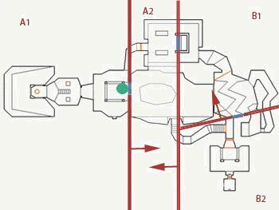

- **Mundos** de jogo podem ser **bem grandes**
- A **maior parte da cena** tipicamente está **fora do _frustum_** da câmera

---
## Uma cena de jogo (2)

- Deixar que a **GPU recorte** a cena <u>toda</u> pode ser **custoso**
  - Devemos tentar **enviar para renderização** apenas os objetos que podem
    **estar no _frustum_**
  - Precisamos de uma **estrutura de dados** para armazenar os objetos da cena:
    1. De forma estruturada e organizada
    1. **Armazenando informação espacial** dos objetos para otimizar a
      renderização
- Podemos usar um **grafo de cena** (tipicamente uma árvore) para tornar fácil
  **descartar partes da cena** que estejam **fora do _frustum_**

---
## Grafo de Cena

- 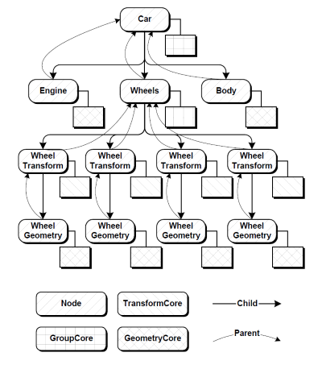
  Segundo Akenine-Müller, é uma:
  
Estrutura em árvore, "orientada ao usuário", que armazena
  a geometria da cena, mas também texturas, transformações, níveis de
  detalhamento, fontes de luz etc.

- Para desenhar a cena, basta percorrer a árvore chamando `this.renderiza()` em
  cada nó.

---
## Grafo de Cena **na Unity**

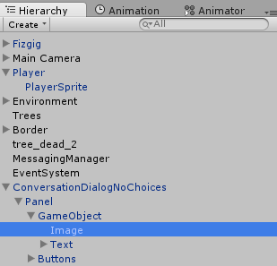

---
## Otimização: _Frustum Culling_

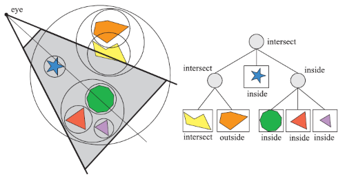

- Particiona-se o espaço (_e.g._, _grid_, _octree_,
  <abbr title="Binary Space Partitioning">BSP</abbr> _tree_) ou a cena
  (_e.g._, <abbr title="Bounding Volume Hierarchy">BVH</abbr>) de forma amostral
- Testa-se cada partição contra o _frustum_ (de forma barata)
- É possível podar a árvore usando a informação espacial

---
## _Frustum Culling_ usando _Octrees_ como Grafo de Cena

<iframe width="640" height="480" src="https://www.youtube.com/embed/H-SsvZZv1sw?rel=0" frameborder="0" allowfullscreen></iframe>

---
## Otimização: _Occlusion Culling_

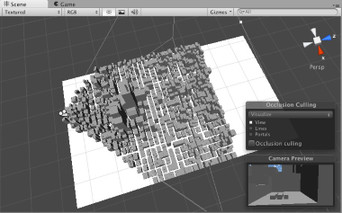
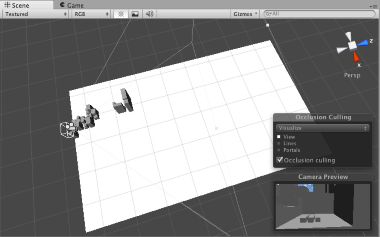

- Ideia: **não desenhar** objetos que estão **atrás de outros** (que são opacos)
- Implementação no espaço: (a) de imagem (projeção), (b) de objeto, (c) de raio
- Recentemente: **_occlusion queries_** feitas no **_hardware_**
  - Rasteriza objeto _off-screen_ e compara com o _z-buffer_

---
## Escolhendo Grafo de Cena + Otimização

- A escolha da estrutura de dados e técnica(s) de otimização dependem
  do "problema" (normalmente, do estilo de jogo). Por exemplo:
  1. **Jogo de luta**: dois personagens lutando em um ringue com ambiente
    estático (exclua Mortal Kombat aqui)
    - Não é necessário otimizar
  1. **Jogo de RTS**: terreno aproximadamente plano, com visão aérea
    - Grafo de cena com uma _quadtree_, fazendo _frustum culling_
  1. **Jogo com câmera FP**: cenário com alta densidade de objetos grandes
    - Grafo de cena com _octree_, fazendo _frustum_ + _occlusion culling_
  1. **Jogo com câmera FP**: cenário mais esparso
    - Grafo de cena com _octree_, fazendo _frustum culling_ apenas

---
<!--
  backdrop: lod-tank
-->

# _Level of Detail_ (LOD)
---
## Nível de Detalhamento (LOD)

- 
  _Level of detail_ involve reduzir a complexidade de um objeto a ser
  renderizado ao passo que ele se distancia da câmera ou outra métrica:
  - importância,
  - velocidade relativa ao espaço da câmera, etc.
- Usando LOD, usamos mais memória (RAM) em troca de menos
  trabalho no _pipeline_ gráfico (menos vértices) sendo
  transformados/iluminados
- A qualidade visual reduzida do modelo tipicamente não é notada porque
  o efeito é reduzido pela distância ou velocidade

---
## Tipos de LOD

- 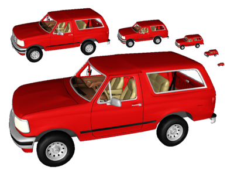
  **Discreto**:
  - Construir um número finito de modelos com número de polígonos
  variando
- **Contínuo**:
  - Codificar um espectro contínuo de detalhes de baixo a alto
- **Dependente da visualização**:
  - Ajustar detalhes do modelo de acordo com o _viewpoint_

---
## LOD **Discreto**

- Abordagem mais simples:
  - Em tempo de execução, apenas o modelo adequado é selecionado e renderizado
- Pros:
  - Funciona bem com as GPUs atuais (_display list_)
  - Mais rápido que LOD contínuo (modo imediatista)
- Cons:
  - Possibilidade de _popping_ durante a troca de nível

---
## Problema: _popping_

<iframe width="640" height="360" src="https://www.youtube.com/embed/KfeFcZDjCRg?rel=0" frameborder="0" allowfullscreen></iframe>

- Exemplo do jogo Arma 2 (2009)

---
## LOD **Contínuo**

- O LOD discreto constrói um número finito de visões
  estáticas do objeto
- O LOD contínuo constrói **uma estrutura de dados a partir da qual extrai-se
  um modelo no nível desejado** em tempo de execução
  - Usa-se, para tanto, os **_shaders_ de geometria e tecelagem**
- Pros:
  - Maior fidelidade ao modelo
  - Melhor granularidade
- Cons:
  - Mais caro

---
## LOD Contínuo: Exemplo

<iframe width="480" height="360" src="https://www.youtube.com/embed/2IMyQUTv9Vk?rel=0" frameborder="0" allowfullscreen></iframe>

---
## LOD **Dependente da Visualização**

- 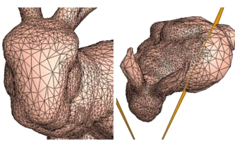
  É um tipo especial de LOD contínuo que considera o ângulo de visualização
- O algoritmo aloca polígonos onde são mais necessários baseado na câmera
- Pros:
  - Objetos grandes são bem melhor amostrados onde estão sendo visualizados

---
## LOD **Dependente da Visualização**: Exemplo

<iframe width="640" height="360" src="https://www.youtube.com/embed/Gmp-WbfF8b8?rel=0" frameborder="0" allowfullscreen></iframe>

- Liktor et al (2014): [_Fractional Reyes-Style Adaptive Tessellation for Continuous Level of Detail_](http://cg.ivd.kit.edu/FracSplit.php)

---
## LOD de **Texturas: _Mipmapping_**

- A técnica de _mipmapping_ de texturas também é LOD
  - **Reduz _aliasing_** causado por filtragem de redução pobre quando
    **uma textura grande é aplicada a uma região pequena da tela**

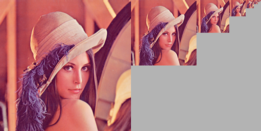

- [Exemplo de CG](http://fegemo.github.io/cefet-cg/classes/textures/#33)

---
<!--
  backdrop: the-witcher-2-shadows
-->

# Sombras em Tempo Real

---
## **Sombras**

- 
  O uso de sombras a uma cena aumenta o realismo e fornece dicas visuais
  para a profundidade e posição de objetos
- As técnicas mais comuns em _real-time_:
  1. ~~_Hack_ simplão~~
  1. _Shadow volumes_
  1. _Shadow maps_

---
## Sombras (1): **_Hack_ simplão**

- 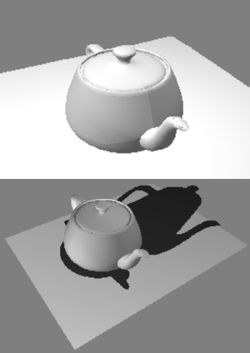
  Renderizar cada objeto duas vezes:
  - Primeiro passo: renderizar normalmente
  - Segundo passo: projetar no plano do chão e renderizar totalmente preto
- Pros:
  - Fácil e até convincente
- Cons:
  - Torna-se rapidamente um problema geométrico complexo
    - Fácil projetar em um plano infinito
    - Mas e numa escada? Morro?

---
## Sombras (2): **_Shadow Volumes_**

- A técnica foi proposta em 1977 (Frank Crow), mas popularizada com o jogo
  Doom 3
- 
  Para cada par <luz, objeto>, computar a região da malha que obstrui a luz
  1. Encontrar a silhueta sob a perspectiva da luz
  2. Projetar a silhueta ao longo dos raios da luz (fazer uma extrusão)
  3. Triangular (gerar triângulos) conectando a silhueta e sua projeção para
     obter o **volume da sombra**
- Um ponto P está na sombra da luz
  L se algum volume de sombra contém
  P
- Tipicamente, usa-se o _stencil buffer_ ([Everitt e Kilgard, 2002](http://arxiv.org/ftp/cs/papers/0301/0301002.pdf))

---
## Sombras (2): **_Shadow Volumes_** (1)

<figure style="margin: auto;">
  
  <figcaption>Volumes de sombras no **Doom 3**</figcaption>
</figure>
- Pros:
  - A sombra é super precisa (a nível de pixel) e não sofre problemas de
    _aliasing_
- Cons:
  - Computacionalmente mais cara que _shadow maps_

---
## Sombras (3): **_Shadow Maps_** (1)

- 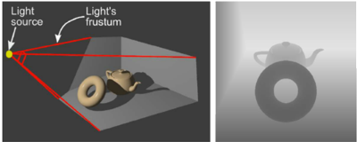
  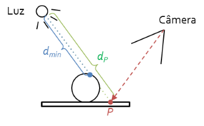
  Renderiza a cena usando **cada fonte de luz como centro de projeção**,
  salvando apenas o _z-buffer_
  - Imagens 2D resultantes são os **mapas de sombras** (uma por fonte de luz)
- Em seguida, renderiza a cena do ponto de vista da câmera
  - Para determinar se ponto P de um objeto está
    na sombra:
    1. Computar a distância d_P de
      P até a fonte de luz
    1. Converter P das coordenadas do mundo para
      coordenadas do _shadow map_ (usando matrizes projection * view usada para gerar o mapa)
    1. Recuperar a distância d_{min} no mapa
    1. P está na sombra se
      d_P > d_{min}, _i.e._, se estiver atrás de um
      objeto mais próximo da fonte

---
## Sombras (3): **_Shadow Maps_** (2)

- 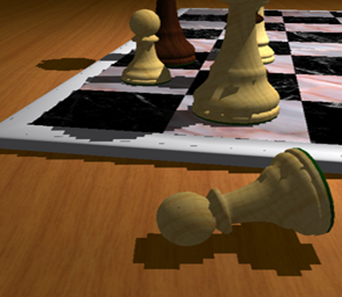
  Pros:
  - Pode ser extendida para ter _soft shadows_
  - Mais barata que _shadow volumes_
- Cons:
  - Implementação simples tem problemas seríssimos de _aliasing_
    - Câmera mais próxima da sombra que a fonte, muitos pixels podem ser
      cobertos por apenas um "texel" do _shadow map_
- Há várias técnicas para resolver o problema de _aliasing_...

---
## Sombras (3): **_Shadow Maps_** (3)

- **_Screen Space Blurred Shadow Mapping_**:
  - Sombras renderizadas em uma textura e ela é borrada e então aplicada na tela
- **_Percentage Closer Filtering_**:
  - Usa mais de um "texel" do _shadow map_ para determinar se ponto está na
    sombra

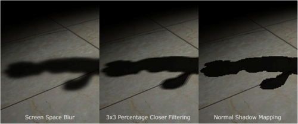

---
## Sombras **em 2D**

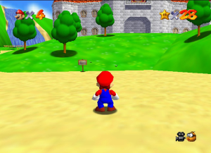

- Em jogos 2D (e até 3D), normalmente simplificamos as sombras a apenas um
  **_shadow blob_**
  - Simplesmente um gradiente circular desenhado nos pés dos objetos
  - Quando o personagem pula, a [figura é aumentada/esmaecida](https://youtu.be/31m02lH46S0?t=38s)
- 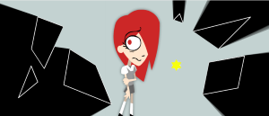
  Recentemente alguns jogos 2D passaram a usar **sombras dinâmicas** usando
  **_raycasting_**
  - Veja um [excelente passo-a-passo](http://ncase.me/sight-and-light/) de
    como fazer

---
<!--
  backdrop: ssao-farcry4
-->

# **_Ambient Occlusion_**
---
## **_Ambient Occlusion_**

- A **obstrução ambiente** aprimora o realismo ao considerar a atenuação da luz
  devido a sua obstrução (_occlusion_)
  - Tenta-se aproximar o caminho da irradiação da luz
- Oclusão ambiente é um método de iluminação global, _i.e._, a iluminação
  em um ponto dada em função da geometria da cena

---
## **_Ambient Occlusion_** (2)

- _Ambient Occlusion_ é normalmente calculada lançando raios em
  várias direções a partir da superfície
  - Raios que chegam ao "vazio" ou "céu" aumentam o brilho da superfície
  - Raios que acertam outros objetos não contribuem para iluminação
- 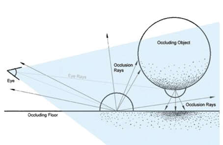
  Resultado: pontos rodeados por outros objetos ficam mais escuros do que
  pontos com pouca geometria próxima

---
## **_Screen Space Ambient Occlusion_** (SSAO)

- Em tempo real, podemos apenas tentar aproximar o _ambient Occlusion_
- <abbr title="Screen Space Ambient Occlusion">SSAO</abbr> é uma técnica
  de aproximação (introduzida pelo Crysis) que faz uso da profundidade
  (_z-buffer_) da cena renderizada
  - Compara a profundidade do fragmento corrente com a profundidade de alguns
    vizinhos para determinar se está obstruído ou não
  - O fragmento corrente está obstruído se a amostra está mais próxima do olho
    do que os fragmentos vizinhos
- Exemplo de [SSAO no Skyrim](https://www.youtube.com/watch?v=aStBEcs38TQ)

---
<figure style="position: relative; width: 100%; height: 600px;>
  
  
</figure>
---
a

---
# Renderização

---
## Características

Features/techniques associated with rendering include:
shading — how the colour and brightness of a surface varies with lighting
texture-mapping —applying detail to surfaces of a 3d mesh
bump-mapping —simulating small-scale bumpiness on surfaces
shadows — the effect of obstructing light
soft shadows — varying darkness caused by partially obscured light sources
reflection — mirror-like or highly glossy reflection
transparency — transmission of light through solid objects
translucency — highly scattered transmission of light through solid objects
indirect illumination — surface illumination by light reflected off other
       surfaces, rather than directly from a light source (global illumination)
depth of field — objects appear blurry when distance from the focal object
motion blur — objects appear blurry due to high-speed relative motion
non-photorealistic rendering — rendering of scenes in an artistic style,
       intended to look like a painting or drawing

---
# Um problema com a Renderização "tradicional"

In traditional ‘forward’ rendering, input geometry is passed through a shader program that suitably manages the geometry and provides an output (lit) colour.
A potential disadvantage of forward rendering is the often high cost associated with the lighting portion of the shader combined with the likelihood of drawing geometry which is later ‘replaced’ by closer geometry.

---
# Referências

- Livro _Game Engine Architecture, Second Edition_
  - Capítulo 10: _The Rendering Engine_
- Livro _Real-Time Rendering, Third Edition_
  - Capítulo 14: _Acceleration Algorithms_
