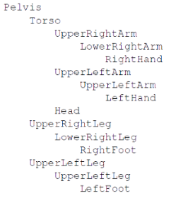
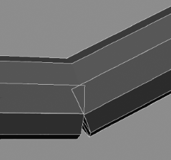
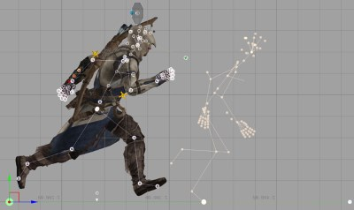
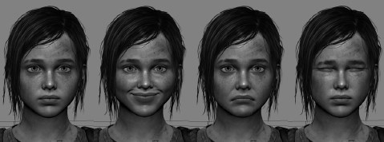
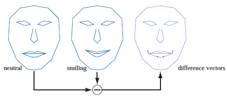
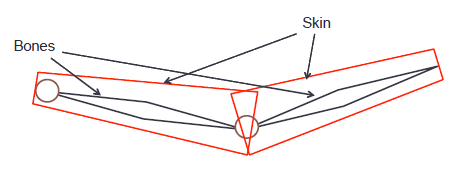
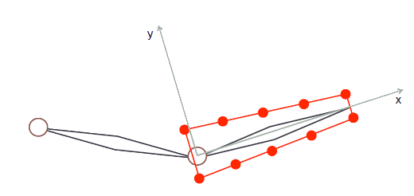

<!--
backdrop: max-payne3
bespokeEvent: bullets.disable
-->

# Animação de Personagens
---
# Roteiro

1. Tipos de Animação
  - Animação em Células
  - Animação Hierárquica Rígida (_skeletal_)
  - Animação por Vértice (/_morph targets_)
  - Animação de Pele
2. Animação de Pele (_skinning_)
  - Mesclagem de Clipes
  - Redirecionamento de Animação (_retargeting_)
  - Animação Procedural

---
## Animação

- Animação não é a mesma coisa que movimento
- A maior parte dos jogos centra nos personagens
  - Tipicamente, humanos, humanóides às vezes animais ou aliens
  - Esses personagens precisam se mover de forma **fluida, orgânica, verossímel**
  - Isso é mais difícil do que animar objetos rígidos (_e.g._, uma bola rolando)
- Mesmo os objetos rígidos podem fazer uso do sistema de animação de personagens (_e.g._, um tanque de guerra)

---
# Tipos de Animação de Personagens

---
## Tipos de Animação de Personagens

- Animação por Células (ou de _sprites_)
- Animações Hieráquicas Rígidas (_skeletal animation_)
- Animações por Vértice/_Morph Targets_
- Animações de Pele (_skinned animation_)

---
## Tipo: **Animação por Células**

- Ilusão de movimento produzida pela **alternância de imagens pré-renderizadas**, tipicamente desenhadas por artistas **quadro a quadro**
- Um personagem pode ter vários **clipes de animação**:
  - À toa (_idle_), andando, correndo, saltando etc.
  - Alguns **clipes fazem _loop_** (_e.g._, andando), outros não (_e.g._, morrendo)

---
## Tipo: **Animação Hierárquica Rígida** (_Skeletal_)

- Personagens são modelados como um conjunto de partes rígidas
  - Quando começamos com jogos 3D, esta foi a "primeira" técnica (Doom ainda usava _sprites_)
- 
  **Partes dispostas em hierarquia** (partindo da pelvis)
  - 
    Problema: "rachaduras" nas juntas
  - Funciona bem para robôs e maquinário, construídos de partes rígidas

---
## Animação _Skeletal_

- Apesar de falarmos em ossos, **o que importa mesmo são as juntas (_joints_)**
- Inicialmente proposto para personagens 3D, mas hoje em dia estamos fazendo também em 2D!
  <ul class="multi-column-inline-list-2">
    <li>
      <figure class="polaroid item-250w">
        
        <figcaption>Avengers: Age Of Ultron – Global Chaos</figcaption>
      </figure>
    </li>
    <li>
      <figure class="polaroid item-250w">
        
        <figcaption>Feito por um artista ([hopeabandoner](http://imgur.com/gallery/6v5Pj0h))</figcaption>
      </figure>
    </li>
  </ul>

---
## **Poses** do Esqueleto

- A **pose de uma junta** é definida com relação à junta pai por:
  - Posição
  - Orientação
  - Escala
- Tipicamente representada por uma estrutura SQT (_**S**cale, Rotation **Q**uaterion, **T**ranslation_)
- **Uma pose de um modelo** é formada pelo **conjunto das poses** relativas **de cada osso** (junta)

---
## **Poses Chave** e **Clipes** de Animação

- 
  Uma **pose chave** é uma pose que representa um extremo de um movimento
- Um **clipe** de animação é formado por uma **sequência de poses chave que são interpoladas**

---
## Interpolação de Pose

- **Clipe**: sequência de poses nos tempos t_1, t_2, ..., t_n
- Para cada tempo t tal que t_i < t < t_j:
  - O motor de animação pode interpolar entre poses definidas em t_i < t < t_j
  - A interpolação gera as poses intermediárias
- <figure class="polaroid item-250w">
    
    <figcaption>[Exemplo](http://dragonbones.github.io/demo.html) usando motor de animação DragonBones</figcaption>
  </figure>
  Já que podemos interpolar poses, podemos executar animações em qualquer velocidade, ou mesmo ao contrário

---
## Tipo: **Animação por Vértice/_Morph Targets_**

- Possibilidade para deformar a malha poligonal
  - Impossível com a animação rígida
  - Muito usado para **representar o rosto do personagem**
- 
  Artista cria objeto em **pose neutra** (_poker face_), depois o deforma em vários extremos (sorrindo, gargalhando, super triste, chorando etc.)
    - Também conhecido como _blendshape_
    - Consegue-se muitas possibilidades usando-se variação de pesos da face neutra + (peso x _blendshape_)

---
## Como funcionam _Morph Targets_/_Blendshapes_

- 
  Dadas duas poses (neutra + outra), computa-se os vetores diferença
- Os vetores são usados para "adicionar" movimentos na
  face neutra
  - Neste caso, pesos positivos resultam no sorriso e
    negativos em um rosto triste

---
## Tipo: **Animação de Pele (_skinned animation_)**

- Método **híbrido entre animação por vértice e por ossos**
  - Existe um esqueleto, mas a malha (pele) deforma para acompanhá-lo
  - O esqueleto não é renderizado
- É a técnica mais usada tanto em jogos (tempo real) quanto em animações

---
## _Skinning_

- A pele é apenas uma malha de triângulos associada ao esqueleto
- Cada malha possui:
  - Uma lista de ossos aos quais a pele está ligada
  - Para cada vértice na malha:
    - Um peso para cada osso: quanta influência ele tem neste vértice

---
## _Skinning_ (2)

- Coordenadas dos vértices da pela são **definidas em relação ao osso**
  - Primeiramente, obtém-se a matriz de transformação do osso
  - Essa matriz é, então, usada em cada um dos vértices da malha da pele

---
## _Skinning_ (3)

- Em geral, vértices da pele podem estar associados a mais de um osso

<figure style="position: relative; width: 100%; height: 226px;">
  
  
  
  
  
</figure>

---
## Uso de _skinning_ **em 2D**

<video width="800" height="308" controls>
  <source src="../../videos/creature-kestrelmoon-raptor.mp4"  type="video/mp4; codecs=avc1.42E01E,mp4a.40.2">
  Seu navegador não suporta o elemento <code>video</code>.
</video>

- Feito no [Creature do Kestrelmoon](http://creature.kestrelmoon.com/index.html)
- Outros:
  - [Spine](http://esotericsoftware.com/)
  - [Puppet2D](http://www.puppet2d.com/)

---
## **Mesclagem de Clipes**

- Dados dois clipes de animação, podemos mesclá-los em um novo clipe
- Usado par **combinar duas ou mais animações** (_e.g._, pulando e atirando) para não precisar fazer as animações combinadas (_e.g._, atirando ao pular)
- Exemplos:
  - **Transição** entre andar e correr
  - Personagem andando + personagem machucado andando = **vários níveis intermediários** de machucado
  - Mirando para esquerda + Mirando para direita = mirando em qualquer ponto entre esses extremos

---
## Mesclagem de Clipes

- Método mais comum é a interpolação linear
  - Computa-se as poses para cada animação no tempo corrente e interpola entre elas
  - Apenas precisamos de um peso que vai de 0 a 1 (de uma animação a outra)

<iframe width="560" height="315" src="https://www.youtube.com/embed/-ec82SKcjkE?rel=0" frameborder="0" allowfullscreen></iframe>

---
## Redirecionamento de Animação (_retargeting_)

- Tipicamente, um clipe é feito para um único esqueleto
- Contudo, se 2 esqueletos forem suficientemente parecidos, animação feita para um pode ser aproveitada pelo outro
  - Diferença permitida: ossos "folha" que não afetem a hierarquia fundamental
  - Basta o sistema de animação ignorar ossos ausentes
- Este é um _hot topic_ da animação de personagens!

---
## _Animation Retarging_ no **Mecanim da Unity**

<iframe width="480" height="360" src="https://www.youtube.com/embed/A9BikRKRG0I?rel=0" frameborder="0" allowfullscreen></iframe>

---
## Animações Procedurais

- Gerada em tempo de execução em vez de ditada por dados capturados ou exportados de uma ferramenta
  - Exemplo: **árvores e vegetação** podem conter ossos, mas serem animadas conforme o vento
- Tipos:
  - Cinemática Inversa
  - _Rag Dolls_ (simulação de molas)
  - Comportamental (simulação de sistema nervoso)

---
## Max Payne 3

<iframe width="640" height="360" src="https://www.youtube.com/embed/bgGcsjCoPSI?rel=0" frameborder="0" allowfullscreen></iframe>

---
## Motor de Animação Procedural Euphoria

<iframe width="640" height="360" src="https://www.youtube.com/embed/HauN98naZ9U?rel=0" frameborder="0" allowfullscreen></iframe>

---
# Referências

- Livro _Game Engine Architecture, Second Edition_
  - Capítulo 11: _Animation Systems_
- [Max Payne 3](https://www.youtube.com/watch?v=bgGcsjCoPSI)
- [Euphoria](https://www.youtube.com/watch?v=HauN98naZ9U) - Sistema "de movimento natural"
